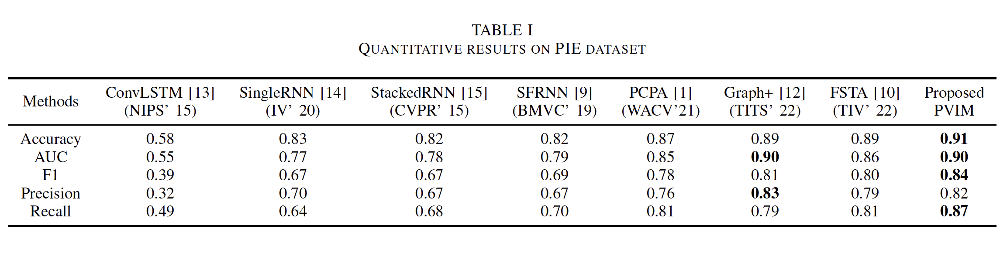
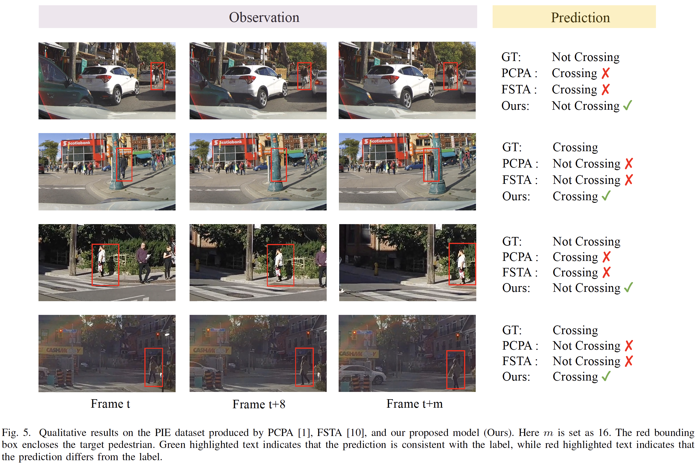

# Pedestrian-Vehicle Information Modulation for Pedestrian Crossing  Intention Prediction 🚗 

<div align="center">

> **Li Xu<sup>1,2</sup>, Shaodi You<sup>2</sup>, Gang He<sup>1</sup>, Yunsong Li<sup>1</sup>**
> 
> <sup>1</sup>Xidian University <sup>2</sup>University of Amsterdam 

[](https://ieeexplore.ieee.org/abstract/document/10670215)&nbsp;
[](https://opensource.org/licenses/MIT)&nbsp;
[](https://icecherylxuli.github.io/projects/PVIM/)&nbsp;

</div>

## 1. Abstract

> Pedestrian crossing intention prediction (PCIP) is crucial for pedestrians' safety in autonomous driving. Existing methods do not use the interaction between pedestrians and cars for their prediction. In this paper, we argue that pedestrians' intentions are highly dependent on their interaction with the environment. Specifically, the trajectories of pedestrians and the dynamic of vehicles jointly affect the entire traffic environment in the future. Therefore, in this paper, we propose a novel pedestrian-vehicle information modulation network (PVIM). Particularly, we first propose a pedestrian-vehicle spatial context (PVSC) that effectively models the spatial dynamics between the pedestrian and ego-vehicle. Second, we design a temporal bilinear attention module that removes temporal redundancy and consolidates temporal correlation for more accurate predictions. We have conducted extensive experiments on the PIE pedestrian action prediction benchmark and have achieved state-of-the-art performance. Specifically, the proposed method achieves an accuracy of 0.91, outperforming the previous best by 2\%.


## 2. Pre-request

### 2.1. Environment Requirement

- Ubuntu 16.04
- CUDA 10.1
- PyTorch 1.6.0+cu101
- Packages: tqdm, lmdb, pyyaml, opencv-python, scikit-image

### 2.2. Create an environment

```bash
$ conda create -n PVIM python=3.8 -y -c conda-forge
$ conda activate PVIM
$ pip install -r requirements.txt
```

### 2.3. Dataset

Download and process the PIE dataset by following the instructions provided in the [PIE GitHub repository](https://github.com/aras62/PIE).


## 3. Train

```bash
$ python train_test.py
```


## 4. Test

The pretrained checkpoint is updated in [GoogleDrive](https://drive.google.com/drive/folders/18DF-QR1lUJvAc7JhELWt5DG7YRuaq7iU?usp=sharing) and [BaiduNetdisk](https://pan.baidu.com/s/1w8QyraPAzMIBROhz9B6ppQ?pwd=2ixc).

After downloading the pretrained checkpoint, place it in the `./models/pie/` directory.


```bash
$ python test.py
```

## 5. Quantitative Results

<p align="center">
    
</p>


## 6. Qualitative Results
<p align="center">
    
</p>


## 📝 Citation
If our work assists your research, feel free to give us a star ⭐ or cite us using:
```
@ARTICLE{10670215,
  author={Xu, Li and You, Shaodi and He, Gang and Li, Yunsong},
  journal={IEEE Transactions on Intelligent Vehicles}, 
  title={Pedestrian-Vehicle Information Modulation for Pedestrian Crossing Intention Prediction}, 
  year={2024},
  volume={},
  number={},
  pages={1-13},
  doi={10.1109/TIV.2024.3437779}}
```

## Acknowledgement

The code is based on [PCPA](https://github.com/ykotseruba/PedestrianActionBenchmark).

### 
